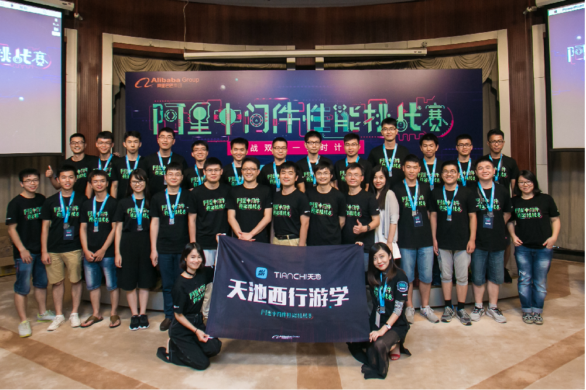

# 比赛题目

对100GB的交易记录建立索引，支持后续高并发查询。查询类型包括1.单条查询，2.聚集查询，3.级联查询。具体详见[大赛网址]( https://tianchi.shuju.aliyun.com/programming/information.htm?spm=5176.100071.5678.2.giWo4e&raceId=231533)。

我们队最终取得了**全国总决赛冠军**的成绩（[线上成绩75%](https://tianchi.shuju.aliyun.com/programming/rankingList.htm?spm=0.0.5678.0.NGQDII&raceId=231533)，答辩成绩25%），[答辩PPT](./Gamma%20Go%E9%98%BF%E9%87%8C%E4%B8%AD%E9%97%B4%E4%BB%B6%E5%86%B3%E8%B5%9B%E7%AD%94%E8%BE%A9PPT.pdf)中展示了我们的设计思路以及优化过程。

# 程序目标

你的coding目标是实现一个继承自OrderSystem接口的OrderSystemImpl类。
实现一些简单的订单查询功能。

* construct接口负责将数据文件路径传送到OrderSystemImpl中，其中storeFolders每个路径包含一块存储设备。用于供你存储内存外的数据。
* queryOrder、queryOrdersByBuyer、queryOrdersBySaler、sumOrdersByGood提供按照特定方式查询数据的接口，具体规则可以查看OrderSystem.java的注释部分

# 数据格式

有三种类型的文件，分别为订单文件、商品文件、买家文件。文件的基本格式相同。
我们对文件格式的约定如下

## 数据格式

* 数据都存储在文件中，每行代表一条记录。
* 每种类型的文件可能包含复数个文件。
* 保证所有文件的记录中的主键不重复。
* 每条记录包含若干Key-Value对。Key又称作字段。
* 每条记录的字段保证不重复。
* Key-Value对之间用制表符'\t'分隔，内容中如果出现空格，把空格当作Key或者Value的内容
* Key为ASCII字符集中的a..zA..Z0..9_-
* Value可以为Boolean, Long, Double, String之中的任意类型，原始数据中不会声明类型
* 如果类型为Boolean，其对应的字符是'true'和'false'
* 记录之间不保证顺序
* 记录内的字段之间也不保证数据
* 可以参考目录中的样例数据：buyer_records.txt、good_records.txt、order_records.txt

每种类型的文件中有一些字段是一定存在的，且类型固定。查询操作主要通过这些字段进行：

## 交易信息文件

一定包含的字段:

  * orderid - 订单号，类型为Long
  * buyerid - 买家ID，类型为String
  * goodid － 商品ID，类型为String
  * createtime - 交易创建时间，类型为Long

## 商品信息文件

一定包含的字段:

  * goodid - 商品ID，类型为String
  * salerid - 卖家ID，类型为String
  
## 买家信息文件

一定包含的字段: 

  * buyerid - 买家ID，类型为String

## 提示

* 数据量上，商品文件和买家文件总大小大于4G，订单文件总大小小于100G。
* 数据中的某些字段比较稀有，在所有记录中出现较少。某些字段比较常见，在记录中经常出现

# 查询条件

一共有四种类型的查询：

1. queryOrder，查询指定订单号的交易信息，可以指定要查询的列
1. queryOrdersByBuyer，查询买家某个时间范围内的交易信息
1. queryOrdersBySaler，查询卖家某个商品的交易信息，可以指定要查询的列
1. sumOrdersByGood，对商品的某个字段进行求和

## 提示

* queryOrder和queryOrdersBySaler两种查询大部分情况下只查询少量字段
* 查询可能存在热点
* 测试程序会并发进行查询，选手程序要保证查询接口能支持并发调用

# 程序打包

程序的类名一定为OrderSystemImpl，并实现一个不带参数的OrderSystemImpl构造函数，提供public访问权限。
Pom配置请参考git中的demo项目[OrderSystemImpl](https://code.aliyun.com/MiddlewareRace/order-system-impl/tree/master)，使用预定义的打包插件。

## 第二/三方库规约

* 仅允许依赖JavaSE 7 包含的lib

# 测试环境

* JDK 1.7
* 多核CPU (暂定6核)
* jvm 4G内存
* 可以使用空间充足的多块磁盘(暂定3块)

# 测试评分

测试程序运行分为两个阶段：

1. 数据准备阶段，从测试程序调用construct开始到测试程序返回，记录时间为T0。如果超过一小时未返回，则判定程序运行失败，不记成绩。
2. 查询阶段，总共有n次查询。为了保证公平，每位选手的查询序列都完全相同。查询的结果会校验正确性，如果返回数据错误，则直接判定程序运行失败。
查询阶段至多运行一个小时，记录完成的查询次数x。如果程序提前完成n次查询，那么记录查询的总时间T1。

成绩排名规则：

1. 如果x < n，那么根据x从大到小进行排名
2. 如果x = n，那么根据 T0 + T1的总耗时从小到大进行排名  

程序运行失败时，我们会给出失败的具体原因以及屏幕输出信息，供选手排查。

由于测试评分进行多天，选手的得分可能会有起伏，我们会记录得分最高的一次作为最后成绩。取得好成绩后，可以大胆的对程序继续优化，博取更好的表现。

# 全量提交结果

通过了417171 case，[log地址](http://ali-middleware-race.oss-cn-shanghai.aliyuncs.com/e3a371d315e.tar.xz)